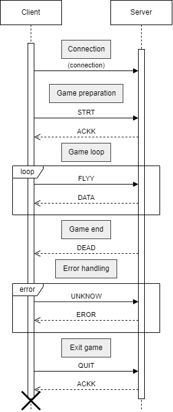

# dai-flappy-bird

This project has been made in the context of [DAI](https://github.com/heig-vd-dai-course/) courses at HEIG-VD

## Authors

- [Antoine Leresche](https://github.com/a2va)
- [Robin Forestier](https://github.com/forestierr)

## Description

Simple Flappy Bird game implemented via a client-server app

# 1. Build

Start by cloning the repository:
```bash
git clone https://github.com/forestier/dai-flappy-bird.git
```

Then, you can compile the project into a JAR located into the target folder:
```bash
./mvnw package
```

# 2. Run the application

...

## 2.1 Launch the server

To be able to run the application in Windows you have to use `javaw` commande.

## 2.2 Launch the client

...

## 2.3 How to play

...

# 3. Application Protocol

## 3.1 Overview

...

## 3.2 Message protocol

### Client messages

| Message               | Description                               |
|-----------------------|-------------------------------------------|
| INIT                  | Start the connection                      |
| STRT                  | Start the game                            |
| DIFF \<difficulty\>   | Set the game difficulty                   |
| FLYY                  | Indicate that the bird is going to fly up |
| LOBY                  | Create a lobby                            |
| JOIN \<num\>          | Join the lobby                            |
| LIST                  | List all existing lobby                   |
| PIPE \<position _y_\> | Place a new pipe                          |
| QUIT                  | Quit the game                             |

_LOBY_, _JOIN_, _LIST_, _PIPE_ is for multiplayer case.

### Server messages

| Message          | Description                       |
|------------------|-----------------------------------|
| ACKK             | Send an ACK to the client         |
| STRT             | Indicate that the game start      |
| DATA             | All the data to show on screen    |
| EROR \<message\> | Error message                     |
| DEAD             | End of the game / death of flappy |

ACKK can be used for basic acknowledgement. For example, if a client has set a new difficulty, an ACK is sent to 
validate the change.

## 3.3 Sequence diagram

### One player



### Two players


### Full lobby scenario


